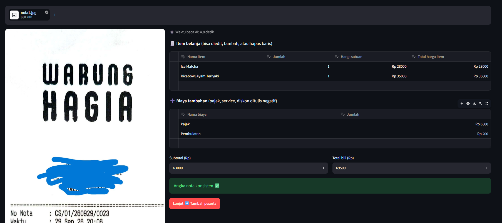
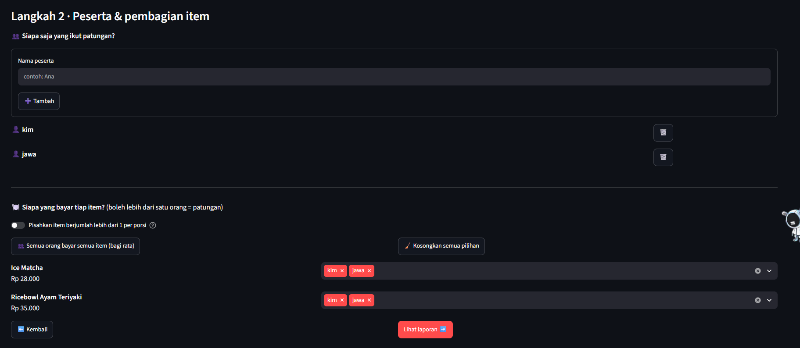
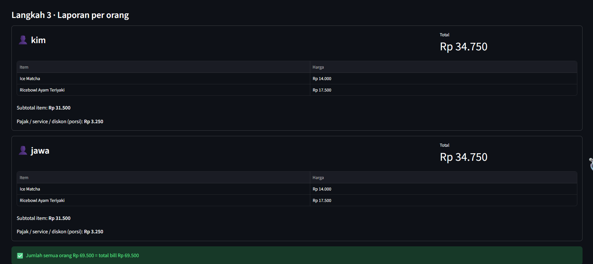
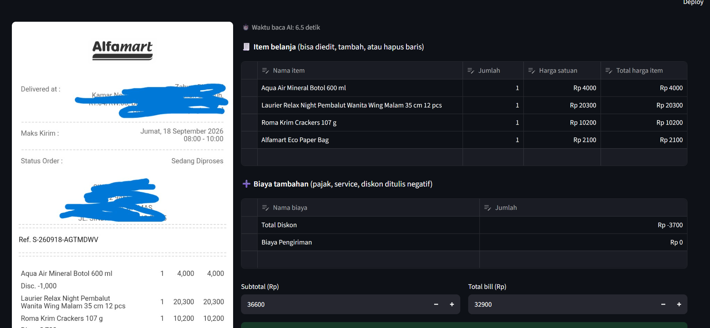
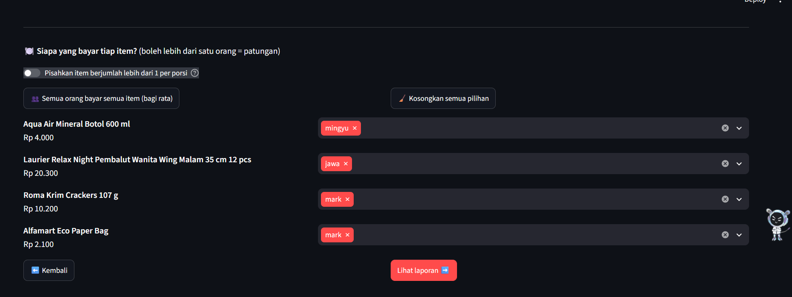
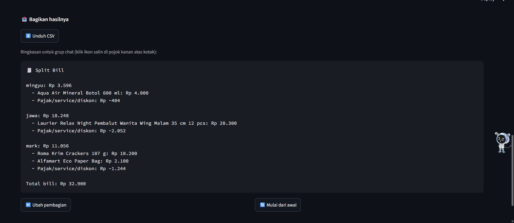

# 💸 SmartSplit Bill AI

Prototype aplikasi web untuk **membagi tagihan (split bill)** dari foto nota. User mengunggah foto struk, AI membaca isinya, lalu user memilih siapa yang membayar tiap item. Aplikasi menghitung total per orang, dan jumlah semua orang **selalu sama persis dengan total bill**.

Dibuat dengan Python + Streamlit untuk Mini Project Product AI (Data Science dan Machine Learning Bootcamp). Alur halaman dan struktur folder mengacu pada template [Day-48-Template](https://github.com/manfredmichael/Day-48-Template).

---

## Daftar isi

1. [Fitur](#fitur)
2. [Alur aplikasi](#alur-aplikasi)
3. [Struktur proyek](#struktur-proyek)
4. [Cara install dan menjalankan](#cara-install-dan-menjalankan)
5. [Step 1: Riset model AI](#step-1-riset-model-ai)
6. [Step 3: Evaluasi dan analisis](#step-3-evaluasi-dan-analisis)
7. [Video demo](#video-demo)

---

## Fitur

**Sesuai requirement tugas**

- Upload foto nota (JPG/PNG), lalu dibaca AI (Gemini via API).
- Membaca data tiap item (nama, jumlah, harga per item, total harga item), subtotal, semua biaya tambahan (pajak, service, pembulatan, dll), dan total bill.
- User memasukkan nama peserta.
- User memilih siapa yang membayar tiap item.
- Laporan total per orang, dengan pengecekan otomatis bahwa jumlah semua orang = total bill.

**Inovasi tambahan**

| Fitur | Manfaat |
|---|---|
| Tabel hasil bacaan **bisa diedit** | Kalau AI salah baca, user bisa memperbaiki langsung |
| **Validasi otomatis** angka nota | Peringatan jika jumlah item ≠ subtotal atau subtotal + biaya ≠ total |
| Item bisa **dibayar beberapa orang** (patungan) | Cocok untuk makanan yang dimakan bersama |
| Mode **pisah per porsi** | Item berjumlah lebih dari 1 (mis. 2 minuman) bisa dibayar orang berbeda |
| Tombol **bagi rata semua item** | Cepat untuk makan bersama |
| Pembagian **tanpa selisih rupiah** | Sisa pembulatan dibagikan sehingga total semua orang tepat sama dengan total bill |
| **Unduh CSV** dan ringkasan teks untuk grup chat | Mudah dibagikan |
| Menampilkan **waktu baca AI** | Bahan analisis kecepatan model |
| Tombol **data contoh** (tanpa AI) | Uji coba tanpa API key atau kuota |
| **Retry otomatis** saat server AI penuh | Aplikasi lebih tahan error |

---

## Alur aplikasi

| Langkah di flow | Halaman di aplikasi |
|---|---|
| User uploads receipt image → OCR reads the receipt → AI read results is shown | **Halaman 1**: upload, baca AI, cek dan edit hasil |
| User specifies names of participants → User assigns items to participants | **Halaman 2**: tambah nama, pilih pembayar tiap item |
| Final report is shown for each participant | **Halaman 3**: total per orang, unduh CSV, ringkasan teks |

---

## Struktur proyek

```
smartsplit-bill/
├── app.py                  # pintu masuk aplikasi (hanya memanggil controller)
├── requirements.txt
├── README.md
├── .env                    # API key (TIDAK diupload ke GitHub)
├── .gitignore
├── notebooks/
│   └── model_research.ipynb   # eksperimen Step 1 (Donut vs Gemini)
├── samples/
│   ├── nota1.jpg              # contoh nota untuk README
│   └── nota2.jpg
├── figs/                   # screenshot aplikasi untuk README
└── modules/
    ├── controller.py       # mengatur halaman mana yang tampil
    ├── extractor.py        # memanggil model AI, hasilnya berbentuk Receipt
    ├── schema.py           # bentuk data (Item, Charge, Receipt) + validasi angka
    ├── splitter.py         # perhitungan pembagian tagihan
    ├── utils.py            # fungsi kecil (format rupiah, pindah halaman)
    └── pages/
        ├── upload_page.py  # halaman 1
        ├── assign_page.py  # halaman 2
        └── report_page.py  # halaman 3
```

Prinsipnya: satu file, satu tugas. Kalau ingin mengganti model AI, cukup mengubah `extractor.py`.

---

## Cara install dan menjalankan

**Prasyarat:** Python 3.12 (versi yang dipakai template), Git, dan API key Gemini gratis dari [Google AI Studio](https://aistudio.google.com).

1. Clone repo dan masuk ke foldernya:

   ```bash
   git clone https://github.com/Jawaaa/smartsplit-bil-AI/tree/main
   cd smartsplit-bil-AI
   ```

2. Buat dan aktifkan virtual environment:

   ```bash
   python -m venv .venv
   ```

   Windows:

   ```bash
   .\.venv\Scripts\activate
   ```

   > Jika muncul error "running scripts is disabled", jalankan sekali di terminal yang sama:
   > `Set-ExecutionPolicy -Scope Process -ExecutionPolicy RemoteSigned`, lalu ulangi perintah aktivasi.

   Mac / Linux:

   ```bash
   source .venv/bin/activate
   ```

3. Install library:

   ```bash
   pip install -r requirements.txt
   ```

4. Buat file `.env` di folder utama, isi dengan API key kamu:

   ```
   GEMINI_API_KEY=tempel_api_key_kamu_di_sini
   ```

5. Jalankan aplikasi:

   ```bash
   streamlit run app.py
   ```

   Aplikasi terbuka di browser (biasanya `http://localhost:8501`).

**Uji cepat tanpa AI:** klik tombol "Pakai data contoh" di halaman pertama, atau jalankan tes hitungan:

```bash
python -m modules.splitter
```

Hasil yang benar: `Ana 68799`, `Ali 233217`, dan jumlah semua `302016` (sama dengan total nota contoh).

---

## Step 1: Riset model AI

Notebook eksperimen: [`notebooks/model_research.ipynb`](notebooks/model_research.ipynb) (dijalankan di Google Colab, GPU T4).

### Data uji

| | Nota 1 | Nota 2 |
|---|---|---|
| Jenis | Struk restoran (Warung Hagia) | Struk pesanan Alfamart |
| Isi | 2 item, pajak, pembulatan | 4 item, diskon per item, biaya pengiriman, harga sudah termasuk PPN |
| File | `samples/nota1.jpg` | `samples/nota2.jpg` |

Data pribadi pada nota (nama, alamat, kontak) sudah ditutup sebelum dipublikasikan.

### Model yang dibandingkan

| Model | Jenis | Cara menjalankan |
|---|---|---|
| **Donut** `naver-clova-ix/donut-base-finetuned-cord-v2` | OCR-free (Hugging Face) | Lokal, GPU Colab |
| **Gemini** `gemini-3.1-flash-lite` | Multimodal (VLM) | API |

Catatan: `gemini-2.5-flash` awalnya dicoba, tetapi sudah tidak tersedia untuk akun baru (error 404). Model Gemini lain sempat mengalami server penuh (503) dan kuota habis (429), sehingga akhirnya dipakai `gemini-3.1-flash-lite` untuk kedua nota agar perbandingan adil.

### Contoh hasil bacaan

**Nota 1 - Gemini (2,6 detik)**

| Item | Jumlah | Harga satuan | Total |
|---|---|---|---|
| Ice Matcha | 1 | 28.000 | 28.000 |
| Ricebowl Ayam Teriyaki | 1 | 35.000 | 35.000 |

Subtotal 63.000 · Pajak 6.300 · Pembulatan 200 · **Total 69.500** (semua sesuai nota)

**Nota 2 - Gemini (4,2 detik)**

| Item | Jumlah | Harga satuan | Total |
|---|---|---|---|
| Aqua Air Mineral Botol 600 ml | 1 | 4.000 | 4.000 |
| Laurier Relax Night Pembalut Wanita Wing Malam 35 cm 12 pcs | 1 | 20.300 | 20.300 |
| Roma Krim Crackers 107 g | 1 | 10.200 | 10.200 |
| Alfamart Eco Paper Bag | 1 | 2.100 | 2.100 |

Subtotal 36.600 · Total Diskon -3.700 · Biaya Pengiriman 0 · **Total 32.900** (semua sesuai nota)

**Donut (1,7 detik dan 1,8 detik) - ringkasan kesalahan**

| Nota | Yang benar | Yang salah |
|---|---|---|
| 1 | Ice Matcha 28.000, Ricebowl 35.000 (tapi tersarang di dalam item pertama), subtotal, pajak, pembulatan, total | Nama toko terbaca sebagai item menu, nomor telepon salah baca, kata "Terbayar" salah tulis, nama kasir masuk ke kolom harga, total muncul berulang di kolom yang salah |
| 2 | Subtotal 36.600, diskon -3.700, total 32.900 | Harga Aqua hilang, nama Roma hilang dan harganya menempel di baris lanjutan Laurier, nama Eco Paper Bag hilang, alamat dan status order terbaca sebagai item, email rusak, biaya pengiriman salah label |

### Tampilan di aplikasi (2 nota uji)

#### Nota 1 (Warung Hagia)

| Hasil bacaan AI | Pilih pembayar | Laporan per orang |
|---|---|---|
|  |  |  |

#### Nota 2 (Alfamart)

| Hasil bacaan AI | Pilih pembayar | Laporan per orang |
|---|---|---|
|  |  |  |

### Perbandingan

| Kriteria | Donut (cord-v2) | Gemini (3.1-flash-lite) |
|---|---|---|
| Waktu nota 1 / nota 2 | 1,7 / 1,8 detik | 2,6 / 4,2 detik |
| Nama item benar | Tidak (sering hilang atau tertukar) | Ya, semua benar |
| Harga item benar | Sebagian | Ya, semua benar |
| Subtotal, biaya tambahan, total | Benar | Benar |
| Format keluaran | Tidak konsisten, banyak data tidak relevan | Konsisten, sesuai skema |
| Kode tambahan yang dibutuhkan | Banyak (memetakan hasil ke format aplikasi) | Tidak ada |
| Butuh internet / API key | Tidak | Ya |
| Butuh GPU | Disarankan | Tidak |
| Batas pemakaian | Tidak ada | Ada kuota, server bisa penuh |

Catatan pengukuran: waktu Donut diukur di GPU Colab dan tidak menghitung waktu memuat model; waktu Gemini mencakup perjalanan lewat internet. Validasi otomatis (jumlah item = subtotal, subtotal + biaya = total) terpenuhi pada semua hasil Gemini.

### Model yang dipilih: Gemini (`gemini-3.1-flash-lite`)

Pada 2 nota uji, Gemini membaca semua nama item, harga, subtotal, biaya tambahan, dan total dengan benar, dan hasilnya langsung sesuai skema data yang dibutuhkan aplikasi. Donut lebih cepat dan bisa berjalan offline, tetapi daftar itemnya berantakan: pada nota Alfamart, nama dan harga beberapa item hilang atau tertukar, dan alamat serta data lain ikut terbaca sebagai item. Karena fitur split bill bergantung pada ketepatan item dan harga, akurasi lebih penting daripada selisih kecepatan beberapa detik.

---

## Step 3: Evaluasi dan analisis

### A. Model pembaca nota

**Kelemahan**

1. **Bergantung pada internet, server, dan kuota.** Selama percobaan muncul error 503 (server penuh) dan 429 (kuota habis). Akun gratis tidak cocok untuk banyak pengguna sekaligus.
2. **Diskon per item tidak terbaca per item.** Di nota Alfamart, diskon Aqua (-1.000) dan Roma (-2.700) hanya terbaca sebagai satu baris "Total Diskon" -3.700, sehingga tidak diketahui diskon itu milik item yang mana.
3. **Data uji sedikit.** Hanya 2 nota yang bersih dan fokus; akurasi pada nota buram, miring, terlipat, atau berformat lain belum diukur.
4. **Privasi.** Foto nota dikirim ke server pihak ketiga (Google). Nota bisa memuat nama, alamat, atau nomor telepon.
5. **Kecepatan tidak stabil.** Waktu baca 2,6 sampai 4,2 detik di Colab dan 4,8 sampai 6,5 detik di aplikasi pada kondisi normal, tetapi bisa jauh lebih lama saat server sibuk.
6. **Donut (model pembanding):** sulit membaca nota berteks kecil atau dengan nama item panjang, mudah terkecoh teks di luar daftar item, dan keluarannya perlu pembersihan.

**Ide perbaikan**

1. Minta AI membaca **diskon per item**, lalu kurangkan langsung dari harga item terkait.
2. Tambahkan **model cadangan** (mis. model Gemini lain atau model lokal) dan **cache hasil bacaan** agar tahan saat API penuh atau kuota habis.
3. Bangun **dataset uji lebih besar** dengan berbagai kondisi nota dan ukur akurasi secara kuantitatif (mis. persentase item dan harga yang benar).
4. Fine-tune model lokal (mis. Donut) dengan nota Indonesia agar bisa berjalan offline dan lebih privat.
5. Tambahkan pra-proses gambar (meluruskan, memangkas, meningkatkan kontras) dan kolom "tingkat keyakinan" agar item yang meragukan ditandai.
6. Sensor otomatis data pribadi (nama, alamat, telepon) sebelum gambar dikirim ke API.

### B. Produk web secara keseluruhan

**Kelemahan**

1. **Data hilang saat halaman di-refresh** karena hanya disimpan di sesi browser (`st.session_state`); belum ada penyimpanan riwayat.
2. **Hanya satu nota per sesi.**
3. **Patungan selalu dibagi rata.** Belum bisa membagi item dengan proporsi tertentu (mis. 60% : 40%).
4. **Biaya tambahan selalu dibagi proporsional** terhadap belanja tiap orang. Belum ada opsi lain (mis. biaya pengiriman dibagi rata).
5. **Diskon per item tidak dinikmati pemilik item**, karena diskon diperlakukan sebagai bagian dari biaya tambahan.
6. **Pilihan pembayar disimpan terpisah untuk tiap mode "pisah per porsi".** Setelah toggle diubah, user harus memilih ulang pembayar di mode yang baru.
7. **Bergantung pada API** sehingga tanpa internet atau API key, fitur baca AI tidak berfungsi (hanya data contoh yang bisa dipakai).
8. Antarmuka baru dalam bahasa Indonesia dan mata uang Rupiah; belum ada tes otomatis selain uji hitungan pada `splitter.py`.

**Ide perbaikan**

1. Simpan riwayat split bill (database sederhana seperti SQLite) dan sediakan link untuk dibagikan.
2. Dukung banyak nota dalam satu sesi dan penggabungan tagihan.
3. Tambahkan pembagian dengan **persentase atau nominal khusus** per orang.
4. Beri pilihan cara membagi biaya tambahan (proporsional, rata, atau dikecualikan).
5. Terapkan diskon langsung ke pemilik item setelah AI membaca diskon per item.
6. Ekspor laporan ke PDF dan tautan pembayaran (QRIS atau transfer) per orang.
7. Tambahkan tes otomatis (pytest) dan dukungan Docker agar mudah dijalankan di mana saja.
8. Dukungan multi-bahasa dan multi-mata uang.

### C. Catatan hasil uji coba aplikasi

Pengujian memakai `nota1.jpg` dan `nota2.jpg` dengan model `gemini-3.1-flash-lite`. Angka "hasil yang diharapkan" dihitung ulang secara terpisah dengan rumus yang sama dengan aplikasi (biaya tambahan dibagi proporsional terhadap belanja tiap orang, sisa pembulatan dibagikan ke pecahan terbesar).

| No | Skenario uji | Hasil yang diharapkan | Hasil aktual | Lolos? |
|---|---|---|---|---|
| 1 | Baca nota 1 dengan AI | Ice Matcha 28.000, Ricebowl 35.000, subtotal 63.000, pajak 6.300, pembulatan 200, total 69.500 | Semua terbaca benar, muncul "Angka nota konsisten ✅" | ✅ |
| 2 | Baca nota 2 dengan AI | 4 item (4.000, 20.300, 10.200, 2.100), subtotal 36.600, diskon -3.700, pengiriman 0, total 32.900 | Semua terbaca benar, nama panjang (Laurier) terbaca utuh | ✅ |
| 3 | Nota 1: Ice Matcha dan Ricebowl dibayar berdua (patungan) oleh kim dan jawa | Subtotal tiap orang 31.500, biaya tambahan 6.500 dibagi 3.250, total 34.750 per orang, jumlah 69.500 | kim Rp 34.750, jawa Rp 34.750, jumlah Rp 69.500 = total bill | ✅ |
| 4 | Nota 2: Aqua = mingyu, Laurier = jawa, Roma dan Eco Paper Bag = mark | mingyu 3.596, jawa 18.248, mark 11.056, jumlah 32.900 | Sama persis, jumlah semua orang Rp 32.900 = total bill | ✅ |

**Waktu baca AI di aplikasi:** nota 1 = 4,8 detik, nota 2 = 6,5 detik. Angka ini mencakup seluruh proses pemanggilan API (termasuk perjalanan jaringan), sehingga bisa berbeda dari hasil di Colab (2,6 dan 4,2 detik).

**Bug atau kejanggalan yang ditemukan:**

Tidak ditemukan bug pada alur utama (upload, baca AI, pilih pembayar, laporan): semua angka sesuai hitungan dan jumlah semua orang selalu sama dengan total bill. Keterbatasan yang ditemukan:

1. **Diskon per item dibagi proporsional, bukan ke pemilik item.** Pada nota 2, diskon Aqua (-1.000) dan Roma (-2.700) tidak jatuh ke mingyu dan mark. Mingyu hanya mendapat potongan Rp 404 dan mark Rp 1.244, sedangkan jawa yang membeli Laurier (tanpa diskon) justru mendapat potongan Rp 2.052.
2. **Data tidak tersimpan.** Memuat ulang halaman browser mengembalikan aplikasi ke halaman awal dan semua data sesi hilang.
3. **Waktu baca 4 sampai 7 detik dan bergantung pada server/kuota API** (saat pengembangan sempat muncul error 503 dan 429, lihat bagian A).

**Hal yang kurang nyaman dari sisi tampilan (UI/UX):**

1. Angka di tabel edit memakai format `Rp 4000` (tanpa pemisah ribuan), sedangkan halaman laporan memakai `Rp 4.000`. Kolom Subtotal dan Total bill juga tanpa pemisah.
2. Di laporan, item patungan tampil dengan nama yang sama dan harga separuh (mis. Ice Matcha Rp 14.000 padahal harga penuh 28.000) tanpa penanda, sehingga bisa membingungkan. Sebaiknya diberi label seperti "Ice Matcha (1/2)".
3. Nilai negatif tampil sebagai `Rp -404`; format `-Rp 404` lebih disarankan.

---

## Video demo

Link video screen record: [Tonton video demo di Google Drive](https://drive.google.com/file/d/1NhAKWuG2ryg9sq0gD1xvcO17QA5IzOq-/view?usp=sharing)

Isi video: upload nota → hasil bacaan AI (dan edit jika perlu) → tambah peserta → pilih pembayar tiap item → laporan per orang dengan jumlah total yang sama dengan total bill.

---

## Kredit

Alur halaman dan tampilan mengacu pada template [Day-48-Template](https://github.com/manfredmichael/Day-48-Template) (courtesy of [MukhlasAdib](https://github.com/MukhlasAdib)).